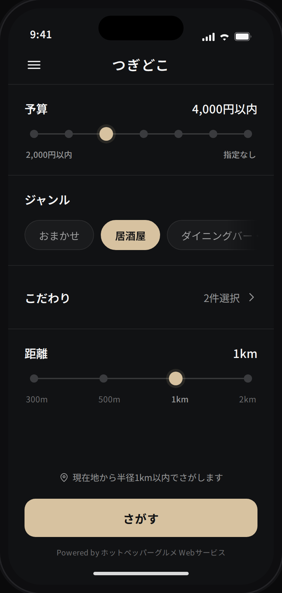
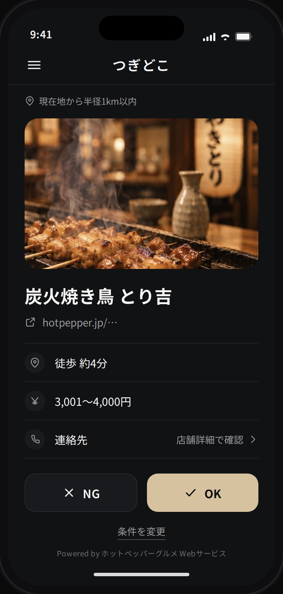
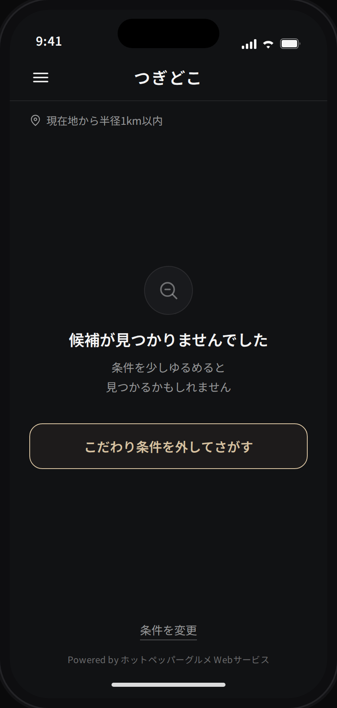
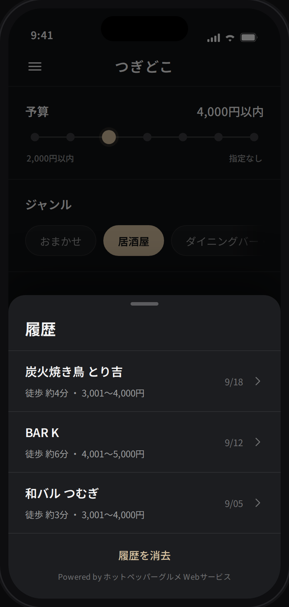

# つぎどこ

2軒目を、1軒だけ。

飲み会の2軒目を決めるためのPWA。条件を設定して「さがす」と、近くの評判の良い店を **1軒だけ** 提案する。合わなければNGで次の1軒、合えばOKで決定。一覧・ランキング・比較は持たない。

店舗情報は [ホットペッパーグルメ Webサービス](https://webservice.recruit.co.jp/) を利用する。

## ドキュメント

| 文書 | ID | 内容 |
| --- | --- | --- |
| [01_要件定義書](docs/01_要件定義書.md) | REQ-001 | 目的・機能要件・検索条件・受入条件 |
| [02_基本設計書](docs/02_基本設計書.md) | BAS-001 | 全体構成・技術スタック・画面フロー |
| [03_フロントエンド設計書](docs/03_フロントエンド設計書.md) | FE-001 | 画面・状態・提示ロジック・デザイン |
| [04_バックエンドAP設計書](docs/04_バックエンドAP設計書.md) | BE-001 | API I/F・外部API境界・セキュリティ |
| [05_データ設計書](docs/05_データ設計書.md) | DATA-001 | Web Storage・永続データ・プライバシー |
| [06_テスト・CI設計書](docs/06_テスト・CI設計書.md) | TEST-001 | テスト観点・CI/CD・手動確認項目 |

## モック

| [トップ](docs/mock/01_トップ画面.png) | [結果](docs/mock/02_結果画面.png) | [候補なし](docs/mock/03_候補なし.png) | [履歴](docs/mock/04_履歴シート.png) |
| --- | --- | --- | --- |
|  |  |  |  |

生成元は [`docs/mock/mock.html`](docs/mock/mock.html)。`node docs/mock/shot.mjs` で再生成できる（[手順](docs/mock/README.md)）。

## ステータス

MVPの実装が一通り完了。デプロイは未実施。

| 領域 | 状態 |
| --- | --- |
| Worker（`/api/search`） | 完了 |
| F/Eロジック（storage / relax / shuffle / reducer） | 完了 |
| 画面 | 完了 |
| PWA | 完了 |
| CI | 完了 |
| 実APIでの動作確認 | **未** — HotPepper APIキーが必要 |
| デプロイ | **未** — Cloudflareの認証情報が必要 |

テスト257件（Worker 145 / F/E 112）。

### 着手前に必要なこと

1. **HotPepper APIキーを取得し、予算マスタを生成する**

   `worker/budget-master.generated.ts` には暫定データが入っている。
   生成環境からHotPepper APIへ到達できず、公開情報から起こした値のため、
   必ず実データへ差し替える。

   ```bash
   HOTPEPPER_API_KEY=xxxx npm run gen:budget
   ```

2. **Cloudflareへの登録**

   ```bash
   npx wrangler secret put HOTPEPPER_API_KEY
   ```

   `ALLOWED_ORIGIN` を本番のオリジンに合わせて `wrangler.jsonc` で更新する。
   GitHub Secrets に `CLOUDFLARE_API_TOKEN` / `CLOUDFLARE_ACCOUNT_ID` を登録する。

3. **実機での確認**

   TEST-001 §8 の手動確認項目を実施する。とくにiOSのPWAでの
   ポップアップ挙動とセッション復帰は自動テストで担保していない。

## 技術スタック

Vite + React + TypeScript / Cloudflare Workers + Static Assets / HotPepper グルメサーチAPI

## セットアップ

```bash
npm ci
cp .dev.vars.example .dev.vars   # HotPepper APIキーを記入（.dev.vars は gitignore 済み）
```

**`npm install` ではなく `npm ci` を使う。** npm 10 系は本プロジェクトの依存関係（vitest の optional peer）で
ideal tree の構築に失敗する。依存を追加・更新するときだけ `npx npm@11 install` を使い、
生成された `package-lock.json` をコミットする。

## 開発

```bash
npm run dev          # F/E（Vite）。/api/* は :8787 へプロキシ
npm run dev:worker   # Worker（wrangler dev）
```

## 検証

```bash
npm run lint
npm run format:check
npm run typecheck
npm run test          # F/E（jsdom）
npm run test:worker   # Worker（workerd 実runtime）
npm run build
```

CIはPRとmainへのpushで同じ内容を実行する（`.github/workflows/ci.yml`）。
テストは外部APIへ通信しない。

## 環境変数

| 名前 | 種別 | 用途 |
| --- | --- | --- |
| `HOTPEPPER_API_KEY` | Secret | HotPepper APIキー。`wrangler secret put` で登録する |
| `ALLOWED_ORIGIN` | Var | `/api/search` を許可するOrigin。`wrangler.jsonc` で管理する |

APIキーをリポジトリへコミットしない。ローカルは `.dev.vars`、本番は Cloudflare Secret を使う。
